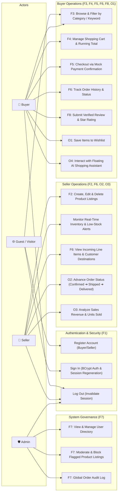

# D2 — Use Case Diagram
## RahimunishaMart E-Commerce Platform

This document describes the functional use cases and actor boundaries spanning all core features (F1–F8) and extensions (O1–O4).

### Traceability to Feature Specifications
- **F1 (Authentication)**: `UC_Register`, `UC_Login`, `UC_Logout` with jBCrypt hashing and session fixation mitigation.
- **F2 (Listing Management)**: `UC_ManageProducts` with image URLs, categorization, and stock counts.
- **F3 (Catalog Discovery)**: `UC_Browse` supporting keyword searches, category filters, and pagination.
- **F4 (Cart Operations)**: `UC_Cart` with real-time running subtotal calculations and quantity boundaries.
- **F5 (Checkout Simulation)**: `UC_Checkout` guaranteeing stock deductions and order creation within atomic DB transactions.
- **F6 (Order Visibility)**: `UC_OrderHistory` for buyers and `UC_SellerOrders` for merchants.
- **F7 (System Administration)**: `UC_ManageUsers`, `UC_Moderate`, and `UC_AuditOrders` with RBAC authorization.
- **F8 (Verified Reviews)**: `UC_Review` enforcing verified purchase checks.
- **O1–O4 (Extensions)**: Wishlist (`UC_Wishlist`), Order status workflow (`UC_OrderStatus`), Sales metrics (`UC_SalesMetrics`), and AI Chatbot Assistant (`UC_Chatbot`).
