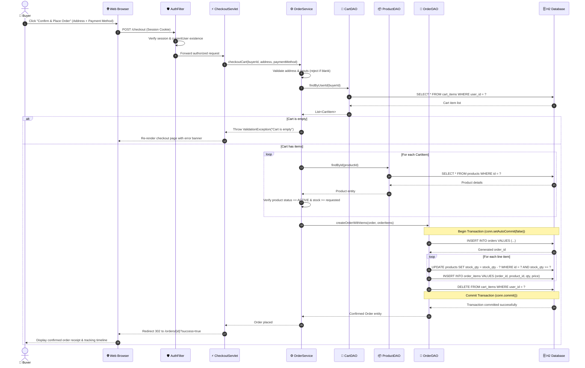

# D3 — Sequence Diagram: Place-Order & Checkout Flow
## RahimunishaMart E-Commerce Platform

The sequence diagram below illustrates the end-to-end atomic checkout and mock payment fulfillment flow, highlighting validation steps, ACID transaction boundaries, inventory stock decrements, and cart clearance.

### Transactional Guarantees & Edge Case Resilience
1. **ACID Transaction Isolation**: The insertion of `orders`, batch insertion of `order_items`, atomic decrement of product inventory, and emptying of `cart_items` are wrapped in a single database transaction.
2. **Concurrency Safety**: Stock reduction executes conditional SQL updates (`WHERE stock_qty >= ?`). If concurrent buyers deplete the remaining stock before transaction commit, an immediate SQL rollback triggers, preventing overselling.
3. **Fail-Safe Rollback**: In the event of any network interruption or database constraint failure, `conn.rollback()` executes inside the `catch` block, ensuring zero corrupted records.
